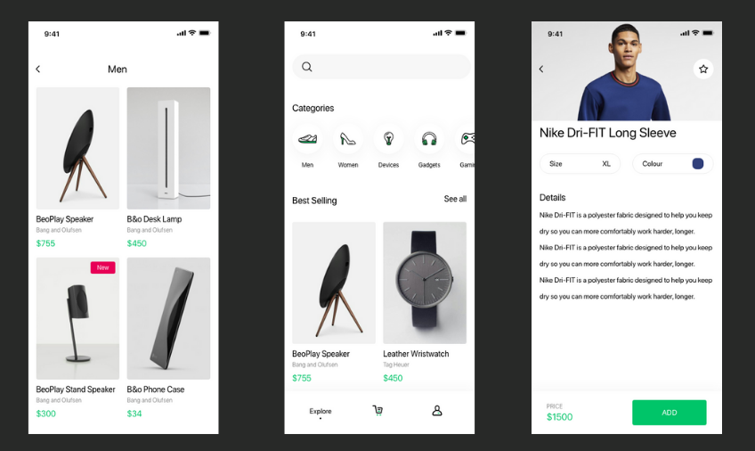

# Flutter Ecommerce Using GetX

### Flutter E-Commerce App Using Getx StateManagement, Firebase, and MVVM
### Getx EcoSystem package - Routing , GetBuilder and Obx
### Google SignIn using Get-X and firebase MVVM
### Facebook SignIn using Get-X and firebase MVVM
### Login and Regitser Functionality
### Save user data on FireStore
### Cart Functionality
### Save user data using SharedPreferences
### Bottom navigation Bar with getx

#### Packages:
- get 
- google_sign_in 
- firebase_core 
- firebase_auth 
- flutter_login_facebook 
- cloud_firestore 

# Screenshot's 

